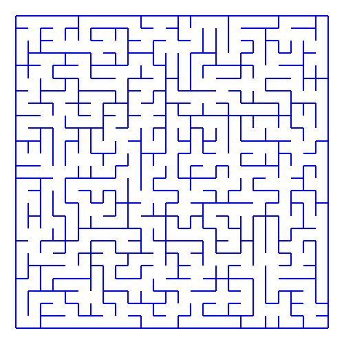
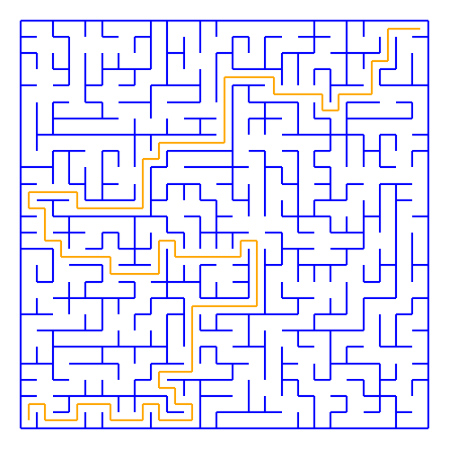
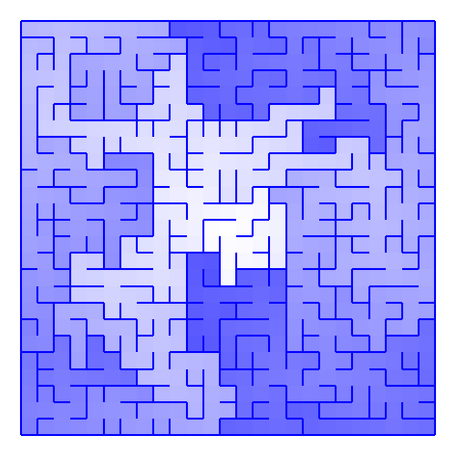
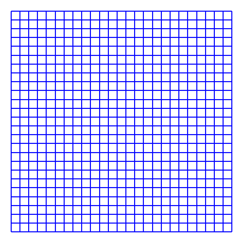

# maze

A collection of algorithms for generating mazes.

Inspired by [*Mazes for Programmers*, by Jamis Buck][1]. Check out [his blog][2]
for more maze-related posts!

## Usage

```
Usage: python main.py <ALGORITHM> <WIDTH> <HEIGHT> <OUTPUT>
where <ALGORITHM> is exactly one of:
  -b : Binary
  -d : Depth-first search
  -h : Hunt and kill
  -k : Kruskal's minimum spanning tree algorithm
  -r : Random walk
  -s : Sidewinder (variant of binary)
  -w : Wilson's algorithm
where <WIDTH> is the width of the generated maze
where <HEIGHT> is the height of the generated maze
where <OUTPUT> is exactly one of:
  --print
    - Print final maze to stdout
  --step <SEC>
    - Print each step to stdout with <SEC> delay
  --outline <PATH>
    - Save maze outline to <PATH>.png
  --solution <PATH> <X1> <Y1> <X2> <Y2>
    - Save maze solution from (X1, Y1) to (X2, Y2) in <PATH>.png
    - Requires 0 <= X1, X2 < WIDTH, 0 <= Y1, Y2 < HEIGHT
  --heatmap <PATH> <X> <Y>
    - Save maze heatmap with center (X, Y) to <PATH>.png
    - Requires 0 <= X < WIDTH, 0 <= Y < HEIGHT
  --paired <PATH> <X1> <Y1> <X2> <Y2>
    - Save maze outline + solution to <PATH>.png, <PATH>_sol.png
    - Requires 0 <= X1, X2 < WIDTH, 0 <= Y1, Y2 < HEIGHT
  --gif <PATH> <FPS>
    - Save maze animation to <PATH>.gif with <FPS>
```

## Features

- Generate mazes using several different algorithms:



- Solve generated mazes:



- Create heatmaps:



- Generate very unoptimized GIFs (note: I used [`gifsicle`][2] to compress these):

#### Binary



#### DFS


#### Hunt


#### Kruskal


#### Random Walk


#### Sidewinder


#### Wilson


[1]: https://pragprog.com/book/jbmaze/mazes-for-programmers
[2]: http://weblog.jamisbuck.org/under-the-hood/
[3]: http://www.lcdf.org/gifsicle/
